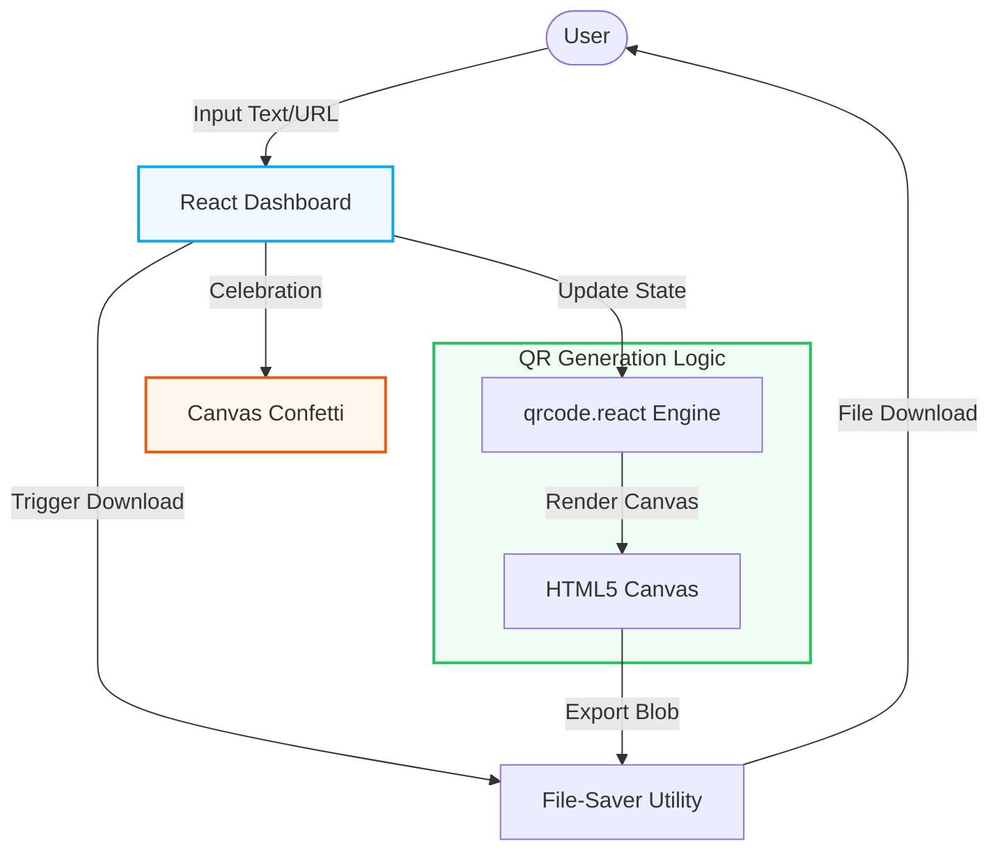

# 🔲 QR Gen Studio
A remarkably fast, production-ready utility tool dedicated to generating, stylizing, and downloading crisp QR codes on the fly.

## 📝 Overview
**Repository / Deployment Link:** https://qrgeneratorr8.netlify.app/)

QR Gen Studio allows individuals and marketing professionals to rapidly transform standard text or URLs into scalable QR codes. Developed using Vite and Tailwind CSS v4, the studio emphasizes zero load-time metrics and relies on `qrcode.react` to render flawless canvas images that are instantly downloadable via `file-saver`.

## ✨ Key Features
- **Instant Rendering**: Characters typed are immediately transformed graphically onto the QR canvas.
- **Download Automation**: Utilizing the `file-saver` capability, clients simply click to export their generated SVGs/PNGs instantly.
- **Celebratory UI Mechanics**: Integrates `canvas-confetti` and `framer-motion` for delightful generation confirmations.
- **Lucide Tooling**: Visual cues managed efficiently with `lucide-react` vector data.

## 🛠 Tech Stack
- Platform Engine: `React 19` + `Vite`
- Rendering Tools: `qrcode.react`
- Utilities: `file-saver`, `canvas-confetti`
- CSS Framework: `Tailwind CSS 4`

## 🏗 Architecture
The application follows a standard React component-based architecture:



1. **Frontend Layer**: Built with React and Vite for blazing fast development and optimized production builds. Handles user input and UI state management.
2. **Rendering Layer**: Utilizes `qrcode.react` to generate high-quality QR codes dynamically on an HTML5 canvas element.
3. **Utility Layer**: Implements `file-saver` for exporting the generated canvas as an image file directly to the user's local machine, and `canvas-confetti` for micro-interactions.

## 📂 File Structure
```text
qr-gen-studio/
├── public/            # Static assets
├── src/               # Main source code
│   ├── components/    # Reusable UI components
│   ├── App.jsx        # Main application component
│   └── main.jsx       # React DOM entry point
├── .env.example       # Example environment variables
├── index.html         # Application entry HTML
├── package.json       # Project metadata and dependencies
├── vite.config.js     # Vite configuration
└── README.md          # Project documentation
```

## 🚀 Getting Started

```bash
# Jump into the studio environment
cd qr-gen-studio

# Fetch the React dependencies
npm install

# Initialize the Vite module hot-reloading server
npm run dev
```


## 🌐 Deployment

### Vercel / Netlify (Recommended)
1. Push this repository to GitHub.
2. Connect your GitHub account to [Vercel](https://vercel.com) or [Netlify](https://www.netlify.com).
3. Select this project and use the following settings:
   - **Build Command:** `npm run build`
   - **Output Directory:** `dist`

### GitHub Pages
1. Install the gh-pages package: `npm install gh-pages --save-dev`
2. Add deployment scripts to your `package.json`.
3. Run `npm run deploy`.

## 👨‍💻 Developer
**Kartik Shete**

<!-- Doc update 6 -->
<!-- Doc update 8 -->
<!-- Doc update 9 -->
<!-- Doc update 12 -->
<!-- Doc update 14 -->
<!-- Doc update 16 -->
<!-- Doc update 17 -->
<!-- Doc update 19 -->
<!-- Doc update 29 -->
<!-- Doc update 32 -->
<!-- Doc update 33 -->
